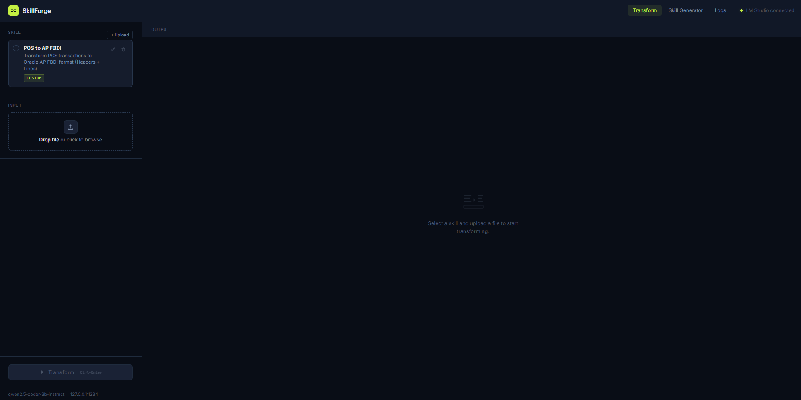

# SkillForge

Local LLM-powered data transformation framework. Define transformation logic in **skill.md** files (the "brain"), while Python handles only common I/O (the "hands"). Upload input and output examples to auto-generate skills, then transform data through a visual web UI — all processing stays on your machine.



## How It Works

```
┌─────────────┐     ┌─────────────┐     ┌──────────────┐
│  Upload File │────▶│  Skill.md   │────▶│  Local LLM   │
│  (CSV, etc.) │     │  (the brain)│     │  (LM Studio) │
└─────────────┘     └─────────────┘     └──────┬───────┘
                                               │
                                               ▼
                                      ┌──────────────┐
                                      │  Validate    │
                                      │  Output      │
                                      └──────┬───────┘
                                               │
                                               ▼
                                      ┌──────────────┐
                                      │  Download     │
                                      │  CSV / ZIP    │
                                      └──────────────┘
```

**Skill.md** controls all transformation logic — mapping rules, business rules, output format.
**Code** only handles common I/O — save CSV, split files, create ZIP, validate output, serve downloads.

## Features

- **Transform** — Upload a file, pick a skill, get transformed output with validation
- **Skill Generator** — Upload input + desired output(s), AI generates a reusable skill template
- **Multi-file output** — `---SPLIT---` markers for generating multiple files (e.g. AP Headers + Lines), bundled as ZIP
- **Real-time logs** — SSE-powered log panel shows LLM processing as it happens
- **Validation engine** — CSV structure, date formats, numeric values, cross-file key consistency
- **Self-correction loop** — when output fails validation, the errors are fed back to the LLM to fix automatically (LangGraph state machine, configurable retries)
- **Async jobs + reconnect** — transforms run as background jobs; the result survives page reloads and navigation, so you can switch tabs while a long transform runs
- **Input ⟷ Output compare** — toggle any result between the transformed output and the original source, with a per-table row-count selector (10 / 25 / 50 / All)
- **History** — every past transform is listed from disk with per-file and ZIP downloads, surviving server restarts
- **LLM observability** — optional [LangSmith](https://smith.langchain.com/) tracing of every prompt, response, latency, token count, and self-correction step
- **Skill management** — Create, edit, delete, upload skills with category tags (Example/Custom)
- **Configurable** — `.env` for LLM endpoint, model, output naming, directories
- **Keyboard shortcuts** — Ctrl+Enter to transform, Escape to close panels

## Quick Start

### Prerequisites

- Python 3.10+
- [LM Studio](https://lmstudio.ai/) (or any OpenAI-compatible local LLM server)

### Setup

```bash
git clone https://github.com/Varinthorn-J/skillforge.git
cd skillforge
python -m venv .venv
.venv\Scripts\activate        # Windows
# source .venv/bin/activate   # macOS/Linux

pip install -r requirements.txt
cp .env.example .env
```

### Run

1. Start LM Studio and load a model (e.g. Qwen 2.5 Coder 3B Instruct)
2. Start the local server on port 1234

```bash
uvicorn app:app --reload --port 8000
```

3. Open [http://localhost:8000](http://localhost:8000)

## Configuration

Edit `.env` to customize:

| Variable | Default | Description |
|----------|---------|-------------|
| `LLM_BASE_URL` | `http://127.0.0.1:1234/v1` | OpenAI-compatible API endpoint |
| `LLM_MODEL` | `qwen2.5-coder-3b-instruct` | Model name |
| `OUTPUT_PREFIX` | `skillforge` | Prefix for output filenames |
| `OUTPUT_SUFFIX` | _(empty)_ | Suffix for output filenames |
| `SELF_CORRECT_MAX_ATTEMPTS` | `2` | Total LLM attempts per transform (`1` disables self-correction) |
| `LOG_LEVEL` | `INFO` | Logging level |
| `LANGSMITH_TRACING` | `false` | Set `true` to trace every LLM call to LangSmith |
| `LANGSMITH_API_KEY` | _(empty)_ | API key from [smith.langchain.com](https://smith.langchain.com/) |
| `LANGSMITH_PROJECT` | `skillforge` | Project name traces are grouped under |

### Self-correction (LangGraph)

When a transform's output fails validation (bad date format, non-numeric value,
mismatched columns, etc.), SkillForge feeds those exact errors back to the LLM
and asks it to fix them — automatically, without user intervention. This is
implemented as a small [LangGraph](https://langchain-ai.github.io/langgraph/)
state machine in [`services/self_correct.py`](services/self_correct.py):

```
generate ──▶ validate ──passed?──▶ END
                 │
              failed & retries left
                 ▼
              correct ──▶ validate ──▶ …
```

Control it with `SELF_CORRECT_MAX_ATTEMPTS` in `.env` (default `2` = one retry).
Set it to `1` to disable correction. The `/api/process` response includes
`attempts` and `corrected` so the UI can show when a fix happened. If `langgraph`
isn't installed, the same loop runs in plain Python — the app still works.

### LLM Observability (LangSmith)

SkillForge can trace every LLM call — prompt, response, latency, and token
usage — to [LangSmith](https://smith.langchain.com/), which is invaluable for
debugging skill prompts and comparing model outputs.

1. Create a free account and API key at [smith.langchain.com](https://smith.langchain.com/)
2. In `.env`, set:
   ```
   LANGSMITH_TRACING=true
   LANGSMITH_API_KEY=lsv2_...
   LANGSMITH_PROJECT=skillforge
   ```
3. Restart the server — traces appear under your project in the LangSmith UI.

Tracing is **fully optional**: with `LANGSMITH_TRACING=false` (the default) the
app behaves exactly as before and needs no LangSmith account. If the `langsmith`
package isn't installed at all, the app still runs — tracing just becomes a no-op.

## Pages

### Transform (`/`)

1. Select a skill from the list
2. Upload your input file (CSV)
3. Click **Transform** (or Ctrl+Enter)
4. View results in table preview with validation report
5. Download output as CSV or ZIP (multi-file)

The transform runs as a **background job**, so you can switch pages or reload
without losing it — when you return, the result (and its download button) is
restored. Use the **Input / Output** toggle to compare the source against the
transformed result, the **Rows** selector to show more or fewer preview rows,
and the **✨ Auto-corrected** badge tells you when the self-correction loop
fixed a validation error.

### History (`/history`)

Lists every past transform, read straight from the `outputs/` folder on disk,
so it survives server restarts. Each entry shows the job id, timestamp, and
per-file plus ZIP download links.

### Skill Generator (`/generator`)

1. Enter a skill name
2. Upload **input file** (source CSV)
3. Upload **output file(s)** (click "+ Add file" for multiple outputs)
4. Click **Generate Skill** — AI analyzes the mapping and creates a skill template
5. Review, edit, then **Save as Skill**

## Writing a Skill

Create a `.md` file in `skills/` (or use the Skill Generator):

```markdown
---
name: POS to AP FBDI
description: Transform POS transactions to Oracle AP FBDI format
input_types: [".csv"]
output_files: ["ap_headers", "ap_lines"]
category: custom
---

# Transformation Rules

For EACH input row, create:
- 1 row in the HEADER file
- 2 rows in the LINES file (ITEM + TAX)

## Header File Columns
INVOICE_NUM = bill_no
INVOICE_DATE = txn_date (change / to -)
VENDOR_NAME = customer_name
...
```

The Markdown body becomes the LLM system prompt. The uploaded file is sent as the user message.

### Output Conventions

| LLM Output | What Happens |
|---|---|
| CSV text | Saved as single CSV file |
| Sections separated by `---SPLIT---` | Split into multiple CSV files + bundled as ZIP |
| Plain text | Displayed as-is in the UI |

## Project Structure

```
skillforge/
├── app.py                    # FastAPI server + LLM integration
├── services/
│   ├── skill_loader.py       # Parses .md skills with frontmatter
│   ├── validator.py          # CSV validation engine
│   ├── self_correct.py       # LangGraph self-correction loop
│   └── transformer_service.py
├── skills/                   # Skill .md files (the "brain")
├── templates/
│   ├── index.html            # Transform page
│   ├── generator.html        # Skill Generator page
│   ├── history.html          # Transform history page
│   └── logs.html             # Standalone logs page
├── static/style.css          # Shared CSS
├── test_data/                # Sample input/output files
├── .env.example              # Configuration template
└── requirements.txt
```

## API Reference

| Method | Endpoint | Description |
|---|---|---|
| `GET` | `/` | Transform page |
| `GET` | `/generator` | Skill Generator page |
| `GET` | `/history` | Transform history page |
| `GET` | `/logs` | Standalone logs page |
| `GET` | `/api/skills` | List available skills |
| `GET` | `/api/skills/{id}` | Get skill content |
| `PUT` | `/api/skills/{id}` | Update skill content |
| `DELETE` | `/api/skills/{id}` | Delete a skill |
| `POST` | `/api/reload-skills` | Reload skills from disk |
| `POST` | `/api/process` | Start a transform job → returns `{job_id, status}` |
| `GET` | `/api/jobs/{job_id}` | Poll a job's status; includes the result when done |
| `GET` | `/api/history` | List past transforms grouped by job (from `outputs/`) |
| `POST` | `/api/generate-skill` | Generate skill from input + output examples |
| `POST` | `/api/upload-skill` | Upload/save a skill file |
| `GET` | `/api/config` | Get current LLM config |
| `GET` | `/api/logs/stream` | SSE real-time log stream |
| `GET` | `/api/download/{filename}` | Download output file |

## Roadmap

Planned features (see [docs/ROADMAP.md](docs/ROADMAP.md) for full proposals):

- **Evaluation set** — measure per-column transform accuracy against ground truth using LangSmith datasets
- **RAG skill selection** — suggest the right skill from an uploaded file via local embeddings
- **Persistent job store** — move the job store from RAM to SQLite/Redis so results survive restarts

## Tech Stack

- **Backend**: Python, FastAPI, Uvicorn
- **LLM**: Any OpenAI-compatible server (LM Studio, Ollama, vLLM)
- **Orchestration**: [LangGraph](https://langchain-ai.github.io/langgraph/) (self-correction loop)
- **Observability**: [LangSmith](https://smith.langchain.com/) (optional tracing)
- **Frontend**: Vanilla HTML/CSS/JS (no build step)
- **Fonts**: Space Grotesk + Inter + JetBrains Mono
